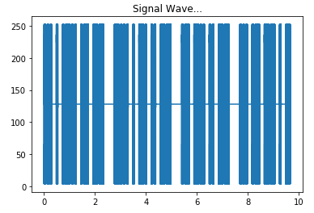
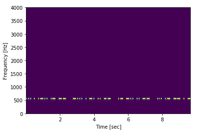

# MorseDecoder
Signal Processing for Morse Decoder

Geliştirmiş olduğum uygulama sayesinde `wav` dosyası olarak kaydedilmiş bir mors dizisini harflere çevirebiliyoruz.
Uygulama sırasıyla çıktı olarak şunlar vermektedir:

- `..././.-../.-/--/-..././-./../--/.-/-../../--/.../.-/--/./-`
- `SELAMBENIMADIMSAMET`

Ben bu dosya üzerinde hangi frekansta işlem yaptığımı bildiğim için sabit bir değer verdim. Çok basit bir örnektir.
